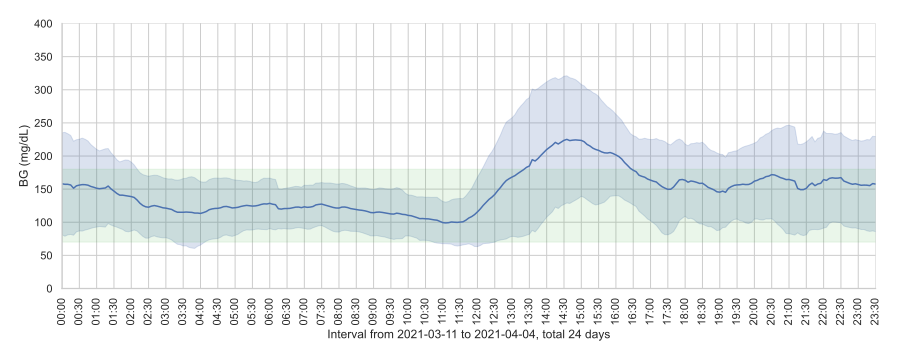

# `sqlite-carelink` - An sqlite3 schema for glucose sensor readings from Medtronic Minimed Carelink

This repository contains:

- `sensor_glucose_schema.sql` SQL statements to create an sqlite3 database
- `import_sensor_readings.py` a python3 script to import sensor readings from a CSV file exported from the CareLink website
- `plot_glucose.py` a python3 script that plots an average day using all available data



## Requirements

For the database you only need `sqlite`. To use the scripts you need:

- python3
- pandas, seaborn, matplotlib, etc. Usually installing just `seaborn` with `pip` is enough.

## Usage

### Creating the database from scratch

```bash
sqlite3 glucose.db < sensor_glucose_schema.sql
```

### Importing a CSV file

```bash
$ python3 import_sensor_readings.py --db glucose.db "Lastname Firstname 04.04.2021.csv"
Inserted 6411 readings
```
### Show plot

```bash
$ python3 plot_glucose.py --help
usage: plot_glucose.py [-h] --db DB [--high-limit HIGH_LIMIT]
                       [--low-limit LOW_LIMIT]

Plot average day glucose chart

optional arguments:
  -h, --help            show this help message and exit
  --db DB               The sqlite3 database path
  --high-limit HIGH_LIMIT
                        Default: 180
  --low-limit LOW_LIMIT
                        Default: 70
$ python3 plot_glucose.py --db glucose.db
```

### Some sample queries in the `sqlite` shell

#### Last 6 month average
```sqlite
sqlite> select avg(value) from sensor_glucose where date(datetime) >= date("now", "-6 months") ;
avg(value)
----------------
147.318047106536
```

This query is also a view named `last_6months` for convenience:

```sqlite
sqlite> select * from last_6months;
avg(value)
----------------
147.318047106536
```

#### Estimating A1C

If you have 14 days or more of sensor data, you can compute an estimate for your A1C. This estimate is called Glucose Management Indicator (GMI).

Definitions and data taken from this page: [Glucose Management Indicator (GMI): A New Term for Estimating A1C From Continuous Glucose Monitoring, Diabetes Care 2018](https://care.diabetesjournals.org/content/41/11/2275)

```sqlite
select cast(gmi_x10 as float) / 10 as GMI from gmi_reference_values where (select * from last_6months) between mean_glucose_mg_dl and up_to;
GMI
----------
6.3
```

This query is also a view named `gmi_prediction` for convenience:

```sqlite
sqlite> select * from gmi_prediction ;
GMI
----------
6.3
```

The reference values are in table `gmi_reference_values`:

```sqlite
sqlite> select * from gmi_reference_values;
mean_glucose_mg_dl  up_to       gmi_x10
------------------  ----------  ----------
100                 124         57
125                 149         63
150                 174         69
175                 199         75
200                 224         81
225                 249         87
250                 274         93
275                 299         99
300                 349         105
350                 700         117
```

## Contributing

Pull requests are welcome.

## License

All code and sample data are licensed under [GNU AGPLv3](https://www.gnu.org/licenses/agpl-3.0.en.html). Copyright 2021 Manos Pitsidianakis
